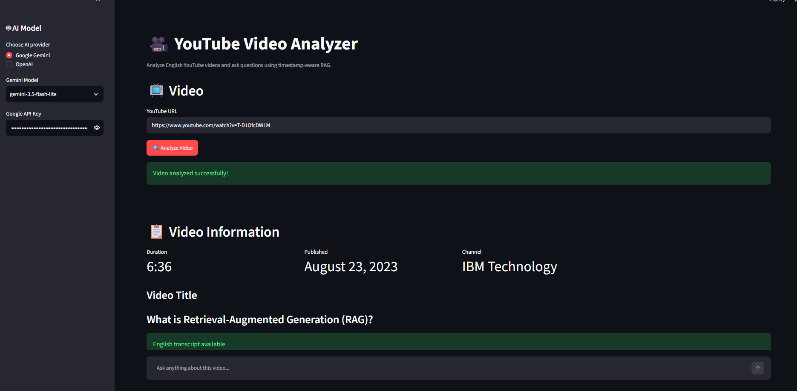
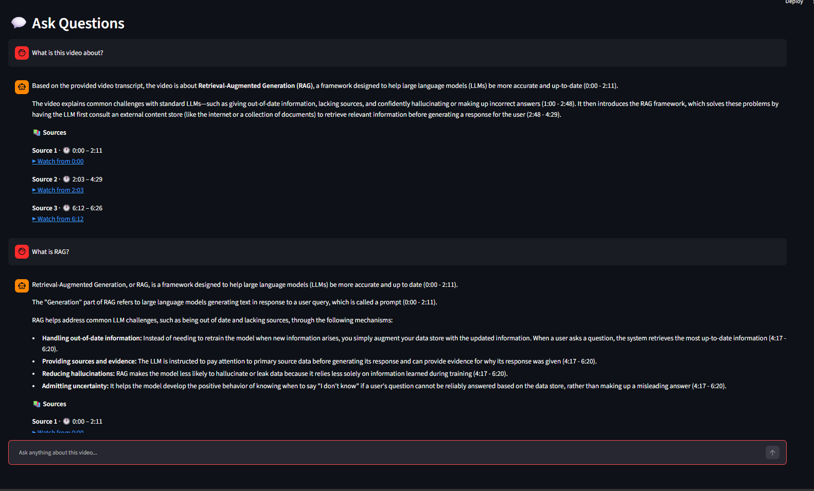

# 🎥 YouTube Video Analyzer

A **Retrieval-Augmented Generation (RAG)** application that enables users to analyze English YouTube videos and ask questions about their content.

The system retrieves relevant transcript segments and generates **grounded answers with timestamped links** to the original video, allowing users to verify the information directly from the source.

---

## 📌 Overview

The application combines:

* YouTube transcript extraction
* Timestamp-aware chunking
* Vector embeddings
* Semantic retrieval
* Video-specific vector storage
* LLM-based answer generation
* Timestamped source references

Users can:

* 🔗 Enter a YouTube video URL
* 📺 View video metadata including title, channel, publication date, and duration
* 📝 Analyze videos with available English transcripts
* 💬 Ask multiple questions through a chat-style interface
* 🧠 Receive answers grounded in retrieved transcript content
* ⏱️ Navigate directly to relevant sections of the video using timestamp links
* 🤖 Select between supported LLM providers

---

## 🖥️ Working Prototype

<p align="center">
  
  
</p>

The prototype provides a Streamlit-based interface for analyzing YouTube videos,
asking questions, and viewing timestamped sources from the retrieved transcript.

---

## 🏗️ Architecture

```text
                         YouTube URL
                              │
                              ▼
                    ┌──────────────────┐
                    │  Video Metadata  │
                    └────────┬─────────┘
                             │
                             ▼
                    ┌────────────────────┐
                    │ English Transcript │
                    └────────┬───────────┘
                             │
                             ▼
                 ┌──────────────────────────┐
                 │ Timestamp-Aware Chunking │
                 └────────────┬─────────────┘
                              │
                              ▼
                    ┌──────────────────┐
                    │    Embeddings    │
                    └────────┬─────────┘
                             │
                             ▼
                 ┌─────────────────────────┐
                 │ Video-Specific ChromaDB │
                 └────────────┬────────────┘
                              │
                              ▼
                    ┌────────────────────┐
                    │ Semantic Retriever │
                    └────────┬───────────┘
                             │
                             ▼
                       ┌───────────┐
                       │ LLM Chain │
                       └─────┬─────┘
                             │
                             ▼
                    ┌─────────────────┐
                    │    RAG Based    |
                    | Question Answer │
                    └────────┬────────┘
                             │
                             ▼
              ┌───────────────────────────────┐
              |  LLM Response with supported  |
              |     Timestamped Sources       │
              └───────────────────────────────┘
```

---

## ✨ Key Features

### 🔍 RAG-Based Question Answering

The system retrieves relevant transcript chunks before generating an answer.

The LLM is instructed to use the retrieved video context as its primary knowledge source, helping keep responses grounded in the analyzed video.

---

### ⏱️ Timestamp-Aware Retrieval

Each transcript chunk maintains its original **start and end timestamps**.

Retrieved sources are converted into YouTube timestamp links such as:

```text
https://www.youtube.com/watch?v=VIDEO_ID&t=343s
```

This allows users to jump directly to the relevant section of the video.

---

### 🗂️ Video-Specific Vector Collections

Each YouTube video is stored in a separate ChromaDB collection using its video ID.

```text
youtube_<video_id>
```

For example:

```text
youtube_dQw4w9WgXcQ
```

This prevents transcript chunks from different videos from being mixed during retrieval.

---

### ♻️ Vector Store Reuse

If a video has already been processed, the existing ChromaDB collection is reused instead of generating embeddings again.

This reduces:

* Unnecessary embedding operations
* API usage
* Processing time

---

### 🤖 Multiple LLM Providers

The application supports configurable LLM providers through the Streamlit interface.

Currently supported:

* **Google Gemini**
* **OpenAI**

The retrieval layer is independent of the selected generation model.

---

### 💬 Chat-Style Interface

Users can ask multiple questions about the analyzed video through a chat-style interface.

Previous messages are displayed in the UI for usability.

However, previous questions and answers are **not passed back to the LLM as conversational memory**.

Each question is processed independently against the video's vector collection.

---

### 🇬🇧 English Transcript Validation

The current implementation supports YouTube videos with an available **English transcript**.

Videos without a suitable English transcript cannot currently be processed.

---

# 🛠️ Technology Stack

| Component             | Technology                      |
| --------------------- | ------------------------------- |
| Language              | Python                          |
| Frontend              | Streamlit                       |
| LLM Framework         | LangChain                       |
| Vector Database       | ChromaDB                        |
| Embeddings            | Gemini `gemini-embedding-2`     |
| LLM Providers         | Google Gemini, OpenAI           |
| Transcript Extraction | YouTube Transcript API          |
| Video Metadata        | YouTube Data API                |
| Configuration         | python-dotenv                   |

---

# 📁 Project Structure

```text
YouTube_Video_Analyzer/
│
├── app.py
├── README.md
├── requirements.txt
├── .gitignore
│
├── src/
│   ├── __init__.py
│   ├── chunker.py
│   ├── embeddings.py
│   ├── pipeline.py
│   ├── qa_chain.py
│   ├── retriever.py
│   ├── vectorstore.py
│   ├── youtube.py
│   └── youtube_metadata.py
│
└── data/
    └── chroma/
```

---

# 🧩 Module Responsibilities

| Module                | Responsibility                                                                   |
| --------------------- | -------------------------------------------------------------------------------- |
| `youtube.py`          | YouTube URL parsing, English transcript extraction, and timestamp URL generation |
| `youtube_metadata.py` | Video title, channel, publication date, and duration                             |
| `chunker.py`          | Timestamp-aware transcript chunking                                              |
| `embeddings.py`       | Embedding model configuration                                                    |
| `vectorstore.py`      | Video-specific ChromaDB collections and collection reuse                         |
| `retriever.py`        | Semantic retrieval                                                               |
| `qa_chain.py`         | Prompt construction and LLM-based answer generation                              |
| `pipeline.py`         | Video preparation and RAG pipeline orchestration                                 |
| `app.py`              | Streamlit application and user interface                                         |

---

# 🚀 Installation

## 1. Clone the Repository

```bash
git clone https://github.com/Souvik007h/YouTube-Video-Analyzer.git
cd YouTube-Video-Analyzer
```

---

## 2. Create a Virtual Environment

### Windows

```bash
python -m venv venv
venv\Scripts\activate
```

### Linux / macOS

```bash
python -m venv venv
source venv/bin/activate
```

---

## 3. Install Dependencies

```bash
pip install -r requirements.txt
```

---

# 🔐 Configuration

Create a `.env` file in the project root:

```env
OPENAI_API_KEY=your_openai_api_key
GOOGLE_API_KEY=your_google_api_key
YOUTUBE_API_KEY=your_youtube_data_api_key
```

The application uses these credentials for the respective APIs.

> ⚠️ **Never commit your `.env` file or API keys to GitHub.**

Recommended `.gitignore` entries:

```gitignore
.env
venv/
__pycache__/
data/chroma/
```

---

# ▶️ Running the Application

Start the Streamlit application:

```bash
streamlit run app.py
```

The application will open in your browser.

---

# 🔄 Typical Workflow

```text
1. Select an LLM provider
          ↓
2. Select the available model
          ↓
3. Enter the corresponding API key
          ↓
4. Enter a YouTube video URL
          ↓
5. Analyze the video
          ↓
6. Review video metadata
          ↓
7. Ask questions about the video
          ↓
8. Review grounded answers
          ↓
9. Follow timestamped source links
```

---

# 💡 Example

A question such as:

> **What is a smart contract?**

is processed through the following pipeline:

```text
                    User Question
                          │
                          ▼
                   Query Embedding
                          │
                          ▼
              Video-Specific Vector Search
                          │
                          ▼
              Relevant Transcript Chunks
                          │
                          ▼
                    Selected LLM
                          │
                          ▼
                  Grounded Answer
                          │
                          ▼
                 Timestamped Sources
```

The response also provides the transcript sections used to generate the answer.

Example:

```text
Source 1
13:11 - 15:18

Watch from 13:11
```

The timestamp link allows the user to verify the answer directly against the original video.

---

# 🧠 Design Considerations

## Video Isolation

Each video receives an independent ChromaDB collection:

```text
youtube_VIDEO_A
youtube_VIDEO_B
youtube_VIDEO_C
```

This prevents retrieval results from unrelated videos from being mixed.

---

## Reusing Existing Embeddings

Before creating embeddings, the application checks whether the video's collection already exists.

If the collection exists:

```text
Existing Collection
        ↓
Reuse Embeddings
        ↓
Skip Re-processing
```

Otherwise:

```text
Transcript
    ↓
Chunking
    ↓
Embedding Generation
    ↓
ChromaDB Collection
```

This helps reduce unnecessary embedding operations and API usage.

---

## Retrieval-Grounded Generation

The LLM receives **retrieved transcript context** rather than the entire video transcript.

The prompt instructs the model to answer using the retrieved context and avoid relying on unrelated external information.

This design keeps the generated responses closely tied to the source material.

---

## Stateless Question Answering

The application provides a chat-style interface for usability.

However, each question is processed independently:

```text
Question 1 → Retrieval → Answer 1

Question 2 → Retrieval → Answer 2

Question 3 → Retrieval → Answer 3
```

Previous questions and answers are displayed in the interface but are **not included in subsequent LLM prompts as conversational memory**.

---

# ⚠️ Limitations

* Currently supports YouTube videos with an available **English transcript**.
* The primary knowledge source is the video transcript.
* Visual content from the video is not directly analyzed.
* Embeddings currently use OpenAI's embedding model.
* The application depends on YouTube transcript and metadata availability.
* API usage may incur costs depending on the selected provider.
* The application is currently designed primarily for local or development use.

---

# 🔮 Future Improvements

Potential improvements include:

* 🎥 Multimodal video understanding using sampled video frames
* 🔤 OCR for slides and on-screen text
* 🎙️ Audio-based transcription fallback
* 🔎 Hybrid keyword + vector retrieval
* 🏆 Retrieval reranking
* 🧩 Semantic chunking
* 📊 RAG evaluation using retrieval and answer-quality metrics
* 🌍 Multilingual transcript support
* 🔌 Embedding-provider selection
* ⚡ Response streaming
* ☁️ Production deployment
* 🔐 Authentication and usage controls

---

# 🔒 Security & Repository Hygiene

The following files/directories should **not** be committed to the repository:

```text
.env
venv/
__pycache__/
data/chroma/
```

The `data/chroma/` directory contains generated vector-store data and can become large over time.

It is therefore recommended to keep it in `.gitignore`.

---

# 📜 License

This project is intended for **educational and portfolio purposes**.

If you plan to distribute the project publicly, consider adding an appropriate open-source license such as the MIT License.

---

# 👨‍💻 Author

**Souvik Halder**

Computer Science & Engineering — Data Science

### Areas of Interest

* Generative AI
* Retrieval-Augmented Generation
* Machine Learning
* Deep Learning
* Computer Vision
* AI Engineering

---

## ⭐ If You Find This Project Useful

Consider giving the repository a ⭐ on GitHub.

Feedback, suggestions, and contributions are welcome.
